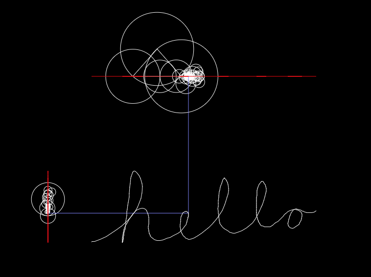

# fourier-transform-epicycle-drawing
Draw an image, and reconstruct it using the Fourier transform and epicycles.

The discrete Fourier transform is implemented.

<h2>Controls:</h2>

click and drag mouse: draw
